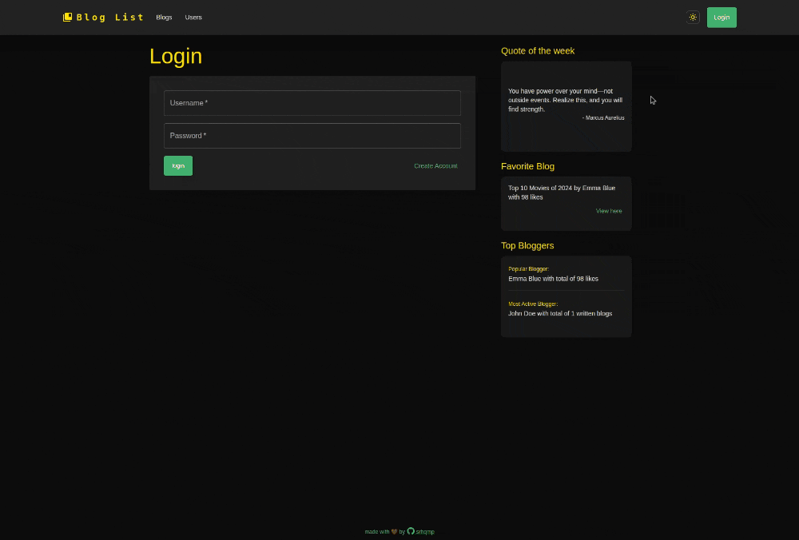

# [Bloglist](https://srhqmp-bloglist.fly.dev/)

A web application for listing and managing blogs built using MERN stack.

 

## Table of Contents
 - About the Project
 - Features 
 - Built With
 - Getting Started
 - Usage

## About the Project
**Bloglist** is a full-stack application that allows users to list blogs, create accounts, log in, manage their blogs, and interact with other users through comments and upvotes. Built with a modern tech stack, it provides an intuitive interface for both bloggers and readers.

## Features
- **User Authentication**:
    - Create an account and log in securely.
- **Blog Management**:
    - Create, edit, and delete blogs.
- **Upvoting**:
    - Users can upvote blogs they like.
- **Commenting**:
    - Add comments to other users' blogs.
- **Responsive Design**:
    - The app is fully responsive and works across devices.
- **Dark and Light Mode**:
    - Users can switch between dark and light themes for a personalized experience.

## Usage
- **User Registration**: Create an account to start using the app.
- **Login**: Access your account to manage blogs.
- **Manage Blogs**: Add, edit, or delete your blogs.
- **Upvote Blogs**: Show appreciation for blogs by upvoting them.
- **Comment on Blogs**: Engage with the community by adding comments to blogs.


[View the demo here](https://srhqmp-bloglist.fly.dev/)

## Built With
### Frontend
  - [React](https://reactjs.org/) - JavaScript library for building user interfaces.
  - [Material-ui](https://material-ui.com/) - React components for faster and easier web development.
  - [Vite]() - Next-generation frontend tooling.
  - [Redux Toolkit]() - Efficient Redux state management.

### Backend
- [Node](https://nodejs.org/en/) - JavaScript runtime for server-side development.
- [Express](https://expressjs.com/) - Fast, minimalistic web framework for Node.js.
- [MongoDB](https://www.mongodb.com/) - NoSQL database for storing blog data.
- [Mongoose](https://mongoosejs.com/) - ODM library for MongoDB.
- [JWT](https://jwt.io/) -  Secure token-based authentication.

## Getting Started
### Prerequisites
To run this project locally, you’ll need:

- Node.js installed on your machine.
- MongoDB for the database.

### Installation
1. Clone the repository:
    ```bash
    git clone https://github.com/srhqmp/bloglist.git
    ```

2. Install dependencies for both the frontend and backend:
    ```bash
    cd bloglist
    npm install
    cd frontend
    npm install
    ```

3. Set up environment variables:
    - Create a `.env` file in the root directory and add the following:
      ```makefile
      MONGO_URI=your-mongo-db-uri
      SECRET=your-secret-key
      ```

4. Run the application:
    - For the backend:
      ```bash
      npm start
      ```
    - For the frontend:
      ```bash
      npm run client
      ```

5. Access the app at `http://localhost:3000`.